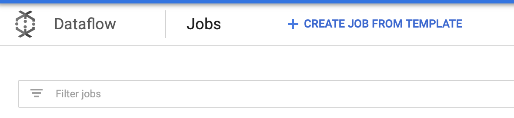
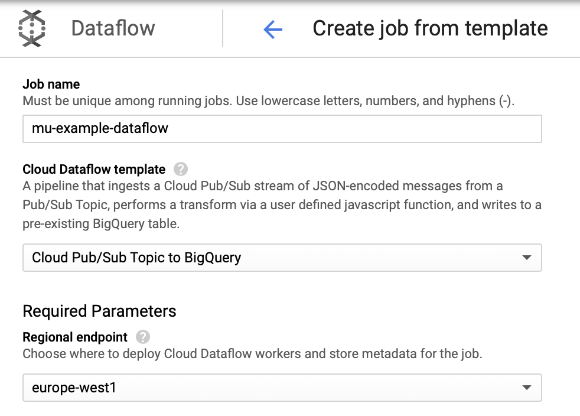
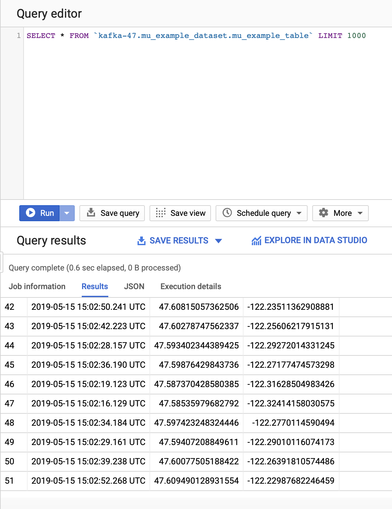
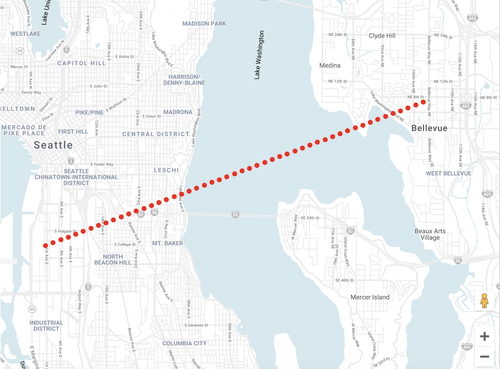

# Mu Smart Home


## Instructions

To run locally the mu server you need a service account with the role `Pub/Sub Publisher and download the json key. Then, it is necessary to export the 
environment variable `GOOGLE_APPLICATION_CREDENTIALS`. It must point to the JSON file that contains your service 
account key.

On the other side, you can deploy a kubernetes cluster with `mu-smart-home` server running on it running the command 
`gcloud deployment-manager deployments create mu-example --config cloudbuild.yaml`. Also, you will deploy a BigQuery 
table and a pubsub topic. You can modify the configuration in the `cloudbuild.yaml` configuration file. To do this, you 
need to grant the role `Security Admin` to the cloudbuild service account.

After the kubernetes cluster is deployed, you can get the credentials with `gcloud container clusters get-credentials mu-cluster`. 
Then you can check the ip of the `mu-smart-home` server with `kubectl get services`. You can run locally the client using 
the right ip and port given by the kubernetes cluster instead of `localhost:9111`.

The data generated will be streamed to the pubsub topic that we have created. But we want this data stored in a BigQuery 
table so we can visualize it with a tool like BigQuery Geo Viz. To do this we are going to use DataFlow from Google Cloud. 

Create a job from a template




The job chosen will be `Cloud Pub/Sub Topic to BigQuery` where we must write `mu-example-pubsub-topic` as input topic 
and `mu_example_dataset.mu_example_table` as the output BigQuery table. 



Once we have everything configured, we can run the job. Now, when we run again our client against the server allocated 
in kubernetes, our data will be stored in the table, so we can select them.



But we want this data as geographic coordinates so we can visualize them in a map. To do so, we can execute the 
following query:
```sql
SELECT
  ST_GeogPoint(long, lat)  AS location,
  timestamp
FROM
  `<project>.mu_example_dataset.mu_example_table`
LIMIT 1000
```

In BigQuery Geo Viz we can execute this query and we will have the following map: 


